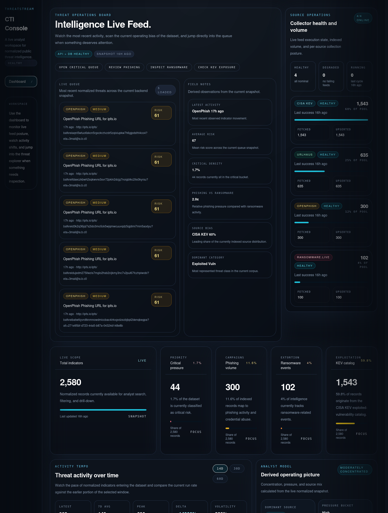
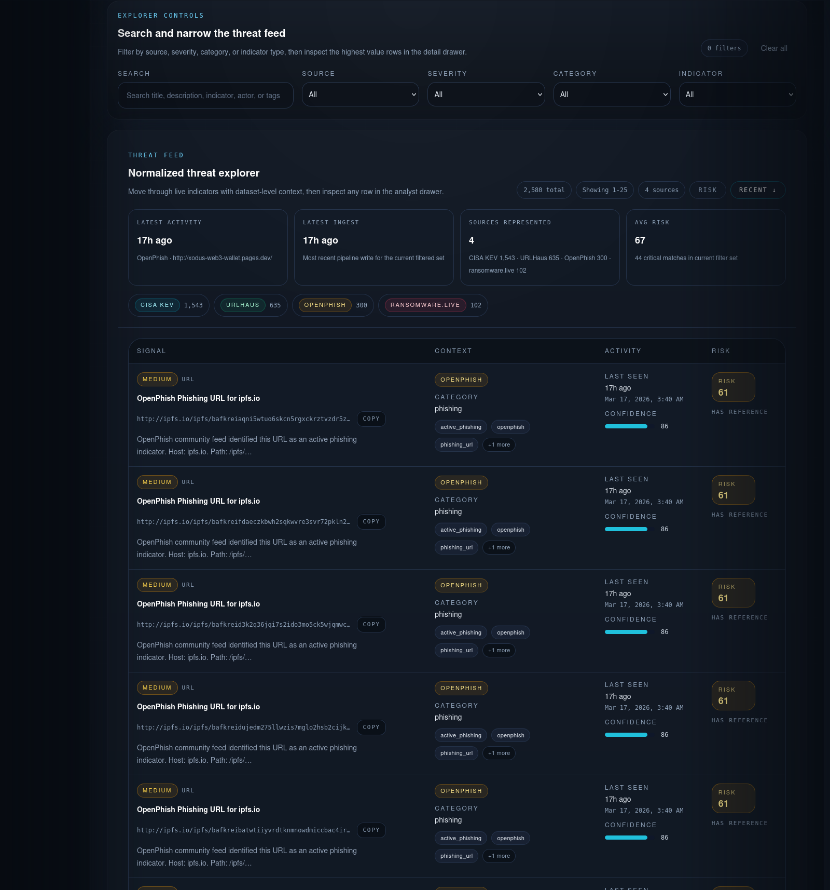

# ThreatStream

ThreatStream is an analyst-first cyber threat intelligence platform that ingests live public threat feeds, normalizes them into a shared schema, scores them with an explainable risk model, and surfaces the result through a modern investigation workflow.

This project was built as a production-minded CTI product rather than a toy dashboard. The goal is to show how real public intelligence can be collected, scored, stored, exposed through an API, and presented in a UI that supports triage instead of just looking decorative.

## Screenshots

### Operations Board



### Threat Explorer



## Why ThreatStream Exists

Threat analysts and SOC teams often rely on fragmented public feeds:

- CISA KEV for exploited vulnerabilities
- URLHaus for malicious URLs
- OpenPhish for phishing indicators
- ransomware.live for victim disclosures

The problem is not access to data. The problem is operational usability.

Each feed uses different structures, timestamps, naming, and context. ThreatStream consolidates those sources into one searchable intelligence workspace so an analyst can move from monitoring to investigation without pivoting across multiple websites and incompatible schemas.

## Core Capabilities

- Aggregates live public threat data from multiple supported feeds
- Normalizes all records into one stable threat intelligence schema
- Preserves original source payloads for investigation and auditability
- Scores every item with a deterministic `risk_score` and mapped `severity`
- Exposes REST APIs for health, dashboard metrics, charts, threat listing, and detail retrieval
- Supports filtering by source, category, severity, indicator type, and free-text search
- Includes a responsive analyst UI with dashboard analytics, live queue visibility, and a detailed explorer
- Tracks collector health, feed freshness, and ingestion status
- Supports manual refresh through a protected admin route
- Uses modular backend services, typed models, and test coverage across ingestion, scoring, and API behavior

## Product Architecture

ThreatStream is structured as a modular monolith with clean boundaries:

```text
Public Feeds
  -> Collector Adapters
  -> Normalized Threat Objects
  -> Deterministic Risk Scoring
  -> Upsert / Persistence Layer
  -> FastAPI Service Layer
  -> React + Vite Analyst Console
```

### Backend

- `FastAPI` for versioned REST APIs
- `SQLAlchemy` ORM for persistence
- `Pydantic` models for settings, schemas, and validation
- `SQLite` for local development, shaped for future PostgreSQL migration
- collector modules per source
- service layer for ingestion, dashboard analytics, and threat retrieval

### Frontend

- `React + Vite + Tailwind CSS`
- dashboard summary cards and operational analytics
- source operations panel for collector health and volume posture
- activity trend views and derived operating signals
- searchable threat explorer with filtering, sorting, pagination, and detail inspection

## Supported Data Sources

| Source | Purpose | Notes |
| --- | --- | --- |
| CISA KEV | Exploited vulnerability tracking | Official public JSON catalog |
| URLHaus | Malicious URL / malware delivery tracking | Uses authenticated supported API flow |
| OpenPhish | Public phishing URL feed | Community feed, intentionally lightweight |
| ransomware.live | Recent ransomware victim events | Event-centric rather than IOC-centric |

## Normalized Threat Model

ThreatStream normalizes source records into a common structure built around analyst workflows:

- `id`
- `source`
- `indicator_type`
- `indicator_value`
- `title`
- `description`
- `category`
- `threat_actor`
- `target_country`
- `first_seen`
- `last_seen`
- `tags`
- `confidence`
- `severity`
- `risk_score`
- `reference_url`
- `raw_payload`
- `created_at`
- `updated_at`

This keeps source-specific parsing isolated inside collectors while the rest of the system works against one stable model.

## Risk Scoring Approach

ThreatStream uses a deterministic scoring engine rather than an opaque heuristic layer. Every threat is scored from `0-100` and mapped into:

- `low`
- `medium`
- `high`
- `critical`

Signals considered by the scorer include:

- source reliability
- category relevance
- recency
- exploitation signals
- phishing context
- ransomware context
- confidence
- critical tags and indicator cues

This makes prioritization readable, testable, and tunable over time.

## API Overview

The backend exposes a practical API surface for the UI and future integrations:

| Method | Endpoint | Purpose |
| --- | --- | --- |
| `GET` | `/api/v1/health` | service and database health |
| `GET` | `/api/v1/threats` | paginated threat listing with filters and search |
| `GET` | `/api/v1/threats/{id}` | threat detail with raw payload |
| `GET` | `/api/v1/dashboard/summary` | top-line dashboard metrics |
| `GET` | `/api/v1/dashboard/charts` | source, category, severity, and timeline datasets |
| `GET` | `/api/v1/dashboard/source-status` | per-collector health and ingestion posture |
| `POST` | `/api/v1/admin/refresh` | protected manual refresh trigger |

## Project Structure

```text
backend/
  app/
    api/
    collectors/
    core/
    models/
    schemas/
    scoring/
    services/
    utils/
  scripts/
  tests/
  pyproject.toml

frontend/
  src/
    app/
    components/
    features/
    hooks/
    lib/
    pages/
    styles/
    types/

data/
  fixtures/
  seeds/

adminRefresh.py
docker-compose.yml
```

## Local Setup

### Prerequisites

- Python `3.11+`
- Node.js `18+`
- npm
- optional `URLHAUS_AUTH_KEY` for the URLHaus collector

### 1. Configure Environment

```bash
cp .env.example .env
```

Set the values you need, especially:

- `ADMIN_API_TOKEN`
- `URLHAUS_AUTH_KEY`

### 2. Start the Backend

```bash
python3 -m venv .venv
source .venv/bin/activate
pip install -e ./backend

cd backend
../.venv/bin/python -m uvicorn app.main:app --reload
```

Backend will be available at:

- `http://127.0.0.1:8000`
- `http://127.0.0.1:8000/docs`

### 3. Start the Frontend

```bash
cd frontend
npm install
npm run dev
```

Frontend will be available at:

- `http://127.0.0.1:5173`

### 4. Refresh Feed Data

```bash
python adminRefresh.py
```

## Testing

### Backend tests

```bash
cd backend
../.venv/bin/python -m pytest tests -q
```

### Frontend build

```bash
cd frontend
npm run build
```

## Engineering Notes

- modular backend structure instead of a single-file API
- deterministic scoring and ingestion designed for unit testing
- upsert-based ingestion to avoid duplicate records across refreshes
- raw source payloads preserved for analyst traceability
- local SQLite development path with portability toward PostgreSQL
- frontend designed as an investigation surface, not a marketing page

## Roadmap

- background job execution for feed refreshes
- PostgreSQL migration with stronger search/indexing
- alerting and saved views
- analyst annotations and case linkage
- richer enrichment layers such as CVSS, WHOIS, geolocation, and reputation context
- authentication and RBAC for multi-user deployments

## Why This Matters For SOC / CTI Workflows

ThreatStream focuses on the operational layer between raw public feeds and analyst action:

- one normalized dataset instead of fragmented source-specific browsing
- explainable prioritization instead of arbitrary visual noise
- source health and freshness visibility so teams know what they are actually looking at
- searchable drill-down from metrics to threat detail without losing source context

That makes the project relevant to SOC, vulnerability intelligence, phishing monitoring, and ransomware tracking workflows.

## License

This repository is currently provided without a license file. Add the license you want before public reuse.
